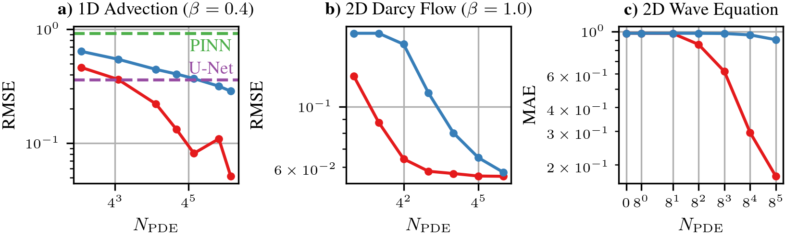

# GP-FVM: Probabilistic Finite Volume Method

[](https://opensource.org/licenses/MIT)
[](https://www.probabilistic-numerics.org)
[](https://www.python.org)
[](https://pytorch.org)


GP-FVM implements a fully probabilistic analogue of the popular Finite Volume Method (FVM) through affine Gaussian process (GP) inference.

Concretely, we provide implementations for FVM observations based on grid-structured observations.
These reduce multi-dimensional integrals to products of one-dimensional integrals, enabling efficient closed-form inference instead of costly numerical quadrature.
The resulting linear systems can be solved either directly through a Cholesky decomposition or iteratively.
We provide various utilities for iterative solvers based on [IterGP](https://github.com/JonathanWenger/itergp) [3].
We build directly on the framework implemented in [LinPDE-GP](https://github.com/marvinpfoertner/linpde-gp) [1] and use utilities from [ProbNum](https://github.com/probabilistic-numerics/probnum) [2].

## Installation

> [!NOTE]  
> This is research code. As such, there is still room for improvement in terms of usability.
> If you have trouble using or understanding our code, please reach out to us, e.g. by creating an issue on GitHub.

### Cloning

This repository includes git submodules. Therefore, please clone it via

```setup
git clone --recurse-submodules https://github.com/timweiland/gp-fvm
```

If you forgot the `--recurse-submodules` flag, simply run

```setup
git submodule update --init --recursive
```

### Requirements

Start with a clean [conda](https://conda.io/projects/conda/en/latest/user-guide/install/index.html) [environment](https://conda.io/projects/conda/en/latest/user-guide/tasks/manage-environments.html) using **Python 3.11**, e.g. through

```setup
conda create -n gp-fvm python=3.11
```

Activate the environment, then run

```setup
pip install -r dev-requirements.txt
```

You should be all set! If something does not work, please reach out to us.

## Usage
[This notebook](experiments/wave/0001_tutorial_wave.ipynb) is a good tutorial on how to use GP-FVM.
It also demonstrates how to switch between a direct Cholesky-based solver and an iterative CG-based solver.

## Running the experiments

Once you've cloned the repository and installed the requirements, you're ready to run the experiments. Move into the `experiments` directory. Then:

```setup
cp .env.example .env
```

and replace the values in `.env`.

You may download the PDEBench data by running `make`.

Afterwards, the subdirectories contain runscripts.
Adapt the parameters to your needs and run them.
For example, to run GP-FVM on an 1D Advection problem class, you may execute

```setup
python3 experiments/advection/run_1d_advection_fv.py --hdf $HDF --beta $BETA --N-pde-t $N_PDE_T --N-pde-x $N_PDE_X --results-path $OUTPUTFOLDER
```

For your convenience, there are also example Slurm job scripts that you can adapt to your needs.

## Results



Red: GP-FVM; blue: collocation.
This figure was produced with the notebook `experiments/0004_pdebench_figure.ipynb`.
Note that you first need to actually run the corresponding benchmarks in `experiments/{advection, darcy, wave}`.

## Background: Affine GP inference

Solving a partial differential equation (PDE) can be framed as a machine learning task through the language of Gaussian processes.
We start with a GP **prior** over the solution of the PDE, which encodes our prior knowledge.
Then, we encode all of the constraints over the solution - i.e. the initial and boundary conditions as well as the PDE - as **linear observations** of the sample paths of our GP.
GPs are nice in the sense that they allow us to directly condition on this linear information.
We can form the GP posterior - with closed-form equations for the mean and covariance function - for which the sample paths fulfill the provided linear observations.


The above figure illustrates what kind of linear observations are being used.
In the figure, we want to learn $u(x) = \sin(x)$ from the differential equation $\frac{\mathrm{d}u}{\mathrm{d}x}(x) = \cos(x)$ with boundary condition $u(0) = u(2 \pi) = 0$.
The idea is to "transform the function into derivative space" and then form observations there.

> [!IMPORTANT]  
> Collocation, which has been the prevailing method for GP-based PDE solvers so far, simply uses pointwise observations.
> GP-FVM instead uses integral observations.
> These observations ensure that the PDE is fulfilled **on average** across the given volume.

> [!NOTE]
> For this specific problem, these kinds of observations are very informative in the original, "non-derivative" space, which can be seen by the collapse in uncertainty.
> This is due to the integral and derivative cancelling each other out through the fundamental theorem of calculus.


## Related work

[1] [LinPDE-GP](https://github.com/marvinpfoertner/linpde-gp): We directly build on the framework implemented in LinPDE-GP. In fact, the core FVM code is implemented in our LinPDE-GP fork.

[2] [ProbNum](https://github.com/probabilistic-numerics/probnum): At a lower level, both LinPDE-GP and our work build on ProbNum, particularly on their `LinearOperator` code and their covariance function definition. Our ProbNum fork implements some further required functionality, including PyTorch support for matrix-vector products on the GPU. 

[3] [IterGP](https://github.com/JonathanWenger/itergp): While we do not directly depend on their code, we do depend on the method itself, which we reimplemented in our LinPDE-GP fork.

## Contributing

If you find any bugs or if you need help, feel free to open an issue.

Pull requests (PRs) are welcome.
We will review them when we have time.
Please use [black](https://github.com/psf/black) to format your code; we may set up some form of CI in the future.

## Citation

If you use this code, please cite our paper

```bibtex
@misc{Weiland2024GPFVM,
      title = {Scaling up Probabilistic PDE Simulators with Structured Volumetric Information}, 
      author = {Weiland, Tim and Pf\"ortner, Marvin and Hennig, Philipp},
      year = {2024},
      publisher = {arXiv},
      doi = {10.48550/arXiv.2406.05020},
      url = {https://arxiv.org/abs/2406.05020}
}
```